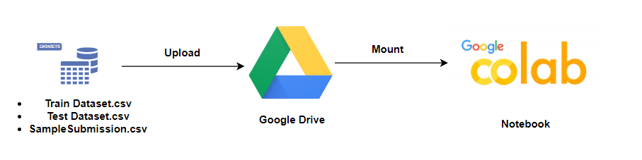
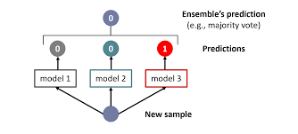

# DSN-X-Microsoft-2024-AI-Bootcamp-Qualification-Hackathon
Heart Disease Prediction for the DSN AI Bootcamp 2024

# Background

Cardiovascular diseases (CVDs), otherwise known as heart diseases are a major cause of morbidity and mortality worldwide, as they pose a huge challenge to public health. An estimated 17.9 million deaths worldwide in 2019 were attributed to CVDs, accounting for 32% of all deaths. In breakdown, heart attacks and strokes accounted for 85% of these deaths. It is noteworthy that the majority of cardiovascular diseases are significantly associated with risk factors that compromise the ethics of a healthy lifestyle. 

To solve this problem, the conventional diagnostic methods often come with substantial costs and time requirements. Thus, there exists a pressing need for a cutting-edge predictive model that can evaluate the risk of heart disease utilizing easily accessible patient information. The objective of this challenge is to design and build a predictive model capable of accurately determining the probability of an individual having heart disease. The focus is on leveraging machine learning techniques to create a model that can analyze relevant features and provide reliable predictions. The model should demonstrate high accuracy and generalizability, ensuring its effectiveness on new, unseen data.

Solving this challenge holds great significance. Early prediction aids in timely intervention and prevention, optimizing healthcare resources. The cost-effectiveness of predictive models reduces unnecessary procedures, benefiting patients and healthcare systems. Targeted public health efforts can stem from aggregated data, and research also advances through model insights. Ultimately, this challenge addresses a crucial healthcare issue using advanced machine learning, promising improved interventions and better health outcomes.

# Environmental Setup

# Feature Engineering

# Hyperparameter Tuning

# Model Ensembling

